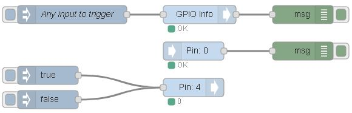

# node-red-contrib-atgpio
A collection of [Node-RED](http://nodered.org) nodes to Configure ADVANTECH IIoT GPIO driver.

Notice that an Advantech IIoT Platform SDK have to be installed to make this node works correctly.
Advantech IIoT Platform SDK download link is shown below:
Windows:
  https://github.com/Advantech-IIoT/Platform-SDK/tree/master/windows/bin
Linux:
  https://github.com/Advantech-IIoT/Platform-SDK/tree/master/linux/bin

## Install
Use npm command to install this package locally in the Node-RED modules directory
```bash
npm install node-red-contrib-atgpio
```
or install it globally with the command
```bash
npm install node-red-contrib-atgpio -g
```
## Nodes included in the package
**GPIO Info :** GPIO information node. Generates a `msg.payload` in JSON format including Pin number, Mode(In/Out), Value(High/Low) of each GPIO pin.

**GPIO input :** GPIO input node. Set the selected GPIO pin to input and then read the value from it.

**GPIO output :** GPIO output node. Set the selected GPIO pin to output and then write a value to it.

---
## Example


Please refer to [`demo.json`](./demo.json) for more detail.

## Tested Platform
- Windows 10 Enterprise LTSB with node.js 6.10.1

## History
- 1.0.5 - October 2017 : Initial Release

## License
Copyright 2017 ADVANTECH Corp. under [the Apache 2.0 license](LICENSE).